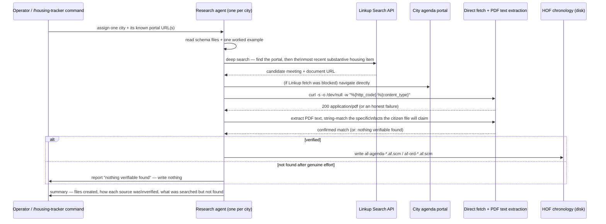

# Housing Tracker

A live tracker of housing builds, adopted policy, and organized opposition to affordable
housing in San Mateo County, CA — sourced entirely from real city meeting agendas and
adopted ordinances, each one individually fetched and verified, never LLM-generated.

**Live**: https://housing-tracker--96eia5.us.sb.tenki.sh (Tenki Cloud sandbox demo)

Companion project to [Builder's Remedy Checker](docs/SUBMISSION-COPY.md), which answers
"can I build here?" for a specific address; this project answers "what's happening right
now across the county, and what can I actually do about it?"

## The problem this tracks

San Mateo County has the Bay Area's highest rate of cities without a state-certified
Housing Element — the exact condition under which incumbent homeowners, institutional
landlords, and fiscally-constrained cities can use procedural tools (discretionary design
review, CEQA threats, ballot-box supermajority requirements) to block or delay new
housing. Every tool in this repo is built to make that structural pattern visible and
actionable, not just documented.

## Architecture

Three independent pieces, connected only by the file-based chronology on disk — no
database, no build step, no LLM in the request hot path:

```mermaid
flowchart LR
    subgraph sources["City sources (ground truth)"]
        portal["City agenda portals\n(Legistar / Granicus /\nCivicPlus / IQM2 / PrimeGov / CivicClerk)"]
    end

    subgraph ingest["Ingestion (research agents, run on demand)"]
        linkup["Linkup Search API\n(discovery)"]
        verify["Direct fetch + verify\n(HTTP status, content-type,\nPDF text-match)"]
    end

    subgraph chronology["HOF chronology (source of truth on disk)"]
        citizens["*.af.scm citizen files\n(af:city-agenda-item,\naf:adopted-ordinance,\naf:shenanigan-instance)"]
    end

    subgraph server["tools/hof-builds-server.mjs (plain Node)"]
        parser["S-expression parser\n(regex + a small\nrecursive-descent tokenizer)"]
        classify["Classifiers\n(housing-signal,\ncapture-mechanism,\nchallenge-checklist)"]
        api["/api/chronology\n(JSON)"]
    end

    subgraph browser["Browser (tools/jargon.js + inline script)"]
        ui["Housing Tracker UI\n(Participate · Upcoming Proposals ·\nPolicy Actions · Cross-Reference · Adversaries)"]
    end

    portal --> linkup --> verify --> citizens
    citizens --> parser --> classify --> api --> ui
```



**Why a plain file chronology instead of a database**: every fact in the UI traces back to
one `.af.scm` file with a provenance comment (source URL, how it was verified, what's
still uncertain) — `git log` on that file *is* the audit trail. The server re-reads the
chronology from disk on every request, so a new citizen file shows up on refresh with no
migration, no restart, no ingestion job to run against a schema.

**Why the client JS is split into a separate static file**: `tools/hof-builds-server.mjs`
builds its HTML response from a JS template literal. Regex word-boundary escapes (`\b`)
inside a template literal are silently consumed as the backspace character, not passed
through to the browser — this actually happened during development and quietly broke the
jargon-tooltip glossary. `tools/jargon.js` (served as a real static file, not embedded in
a template string) is where anything containing `\b`/`\d`/`\s` regexes has to live.

## The ingestion pipeline

This is the part packaged as the [`housing-tracker` Claude Code plugin](claude-plugins/housing-tracker/)
— the exact process used to take chronology coverage from 6 to 21 San Mateo County
jurisdictions in one 15-agent parallel fanout:



Two real bugs this pipeline caught and fixed along the way, worth knowing if you extend
it:

1. **A naive housing-signal keyword match false-positives on items that explicitly say
   they are *not* housing** — e.g. a commercial R&D building's own description explains,
   in prose, why it's a non-housing contrast case, and that explanation contains the word
   "housing" several times. Fixed with an explicit self-declared-exclusion check that runs
   before the keyword match (see `claude-plugins/housing-tracker/skills/housing-tracker/references/classification-heuristics.md`).
2. **A regex expecting a plain quoted string breaks on a legitimately embedded, escaped
   quote** inside an agenda item's own text (Scheme's `\"..\"` convention) — this silently
   dropped a real, correctly-ingested record from the feed entirely until the parser was
   fixed to tolerate `\"` sequences.

## Data model

```scheme
;; A planning-commission/city-council agenda item
(af:city-agenda-item city body meeting-date agenda-item source-url)

;; An adopted ordinance / zoning change / ballot measure
(af:adopted-ordinance city ordinance-number title adopted-date effective-date source-url)

;; A structural-capture instance — who benefited from blocking/delaying housing, and how
;; (feeds the Adversaries tab)
(af:shenanigan-instance jurisdiction mechanism beneficiary-classes
                         price-supply-effect target-project date outcome
                         source-urls confidence)
```

Full schema definitions with field-level docs and Gherkin scenarios live at
`HOF/2026/09/05/12/` (agenda item / ordinance) and `HOF/2026/09/05/21/` (shenanigan
instance / the mechanism and beneficiary-class taxonomies).

## Repo layout

| Path | What it is |
|---|---|
| `HOF/` | The chronology — every sourced fact, one `.af.scm` citizen per file |
| `tools/hof-builds-server.mjs` | The whole server: parses the chronology, classifies it, serves the UI |
| `tools/jargon.js` | Client-side glossary, letter/checklist generation, DOM tooltip logic |
| `claude-plugins/housing-tracker/` | The installable Claude Code plugin wrapping the ingestion methodology |
| `.claude/skills/` | Project-local skills used while developing this repo (Linkup, Tenki sandbox) |
| `docs/smc_jurisdictions - smc_jurisdictions.csv` | Known agenda-portal URLs per jurisdiction (treat as a starting lead, not ground truth — portals migrate) |
| `app/` | The separate, earlier Builder's Remedy Checker Next.js app (own README/pipeline) |

## Running it locally

```bash
node tools/hof-builds-server.mjs 4173
```

No build step, no dependencies beyond Node itself. Open `http://localhost:4173`.

## Deploying

Currently demoed on a [Tenki Cloud](https://tenki.cloud) sandbox (`tenki sandbox expose`)
— see `.claude/skills/tenki-sandbox/SKILL.md` for the exact commands. Any host that can run
a long-lived Node process and clone this public repo works equally well; there's no
database or build artifact to provision.
